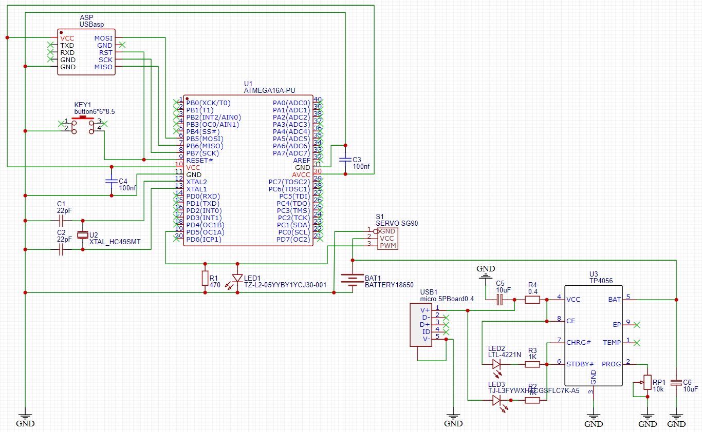
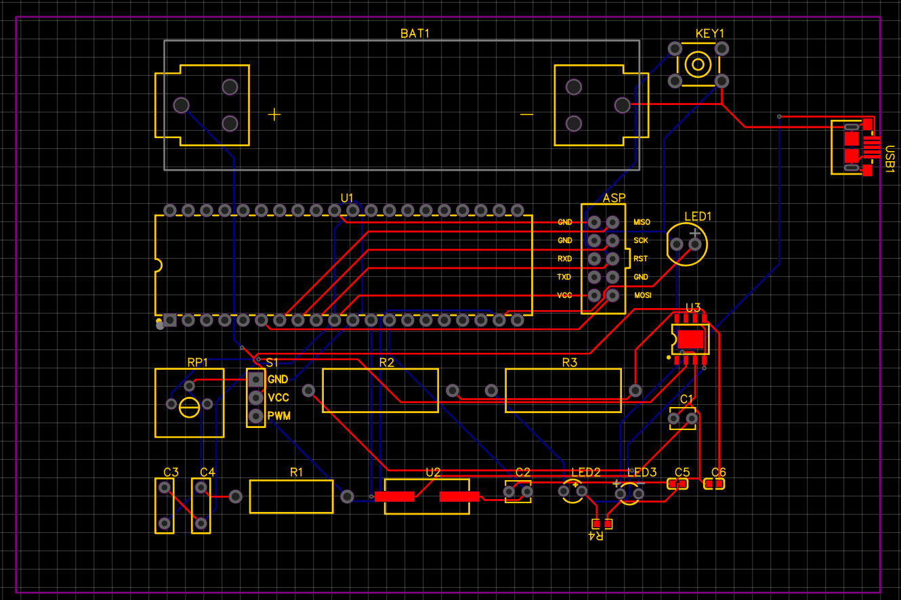
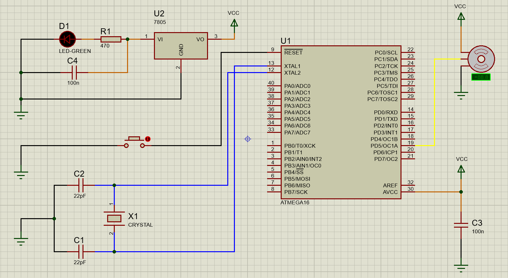

# Interfacing servomotor with AVR microcontroller Atmega16

Proiectul are ca scop controlul unui Servomotor cu ajutorul unui microcontroller ATMEGA16. Unghiul de rotatie al servomotorului poate fi controlat prin aplicarea unui semnal PWM. Servomotorul se poate roti de la 0° la 180°. Alimentarea servomotorului se face de la un acumulator Li-Ion 18650, care poate fi încărcat la portul microUSB al modulului TP4056.

## Componente

- Microcontroller AVR ATMEGA16A-PU
- Micro Servomotor SG90
- Cristal de Quartz 16MHz HC49S
- Condensator Ceramic 22pF x2
- Condensator Ceramic 100nF x2
- Programator AVR USBASP v2.0
- LED galben
- Rezistență 470 ohm
- Push Button
- Breadboard
- Acumulator Li-Ion 18650
- Încărcător baterii TP4056

## Schema în EasyEDA a circuitului

## PCB-ul pe 2 layere al circuitului

## Schema în Proteus a circuitului

## Simularea în Proteus a circuitului

https://user-images.githubusercontent.com/56690190/147746440-a57f5066-b13e-49ce-a5e7-90814fc9d384.mp4

## Imagini cu schema realizată pe breadboard

